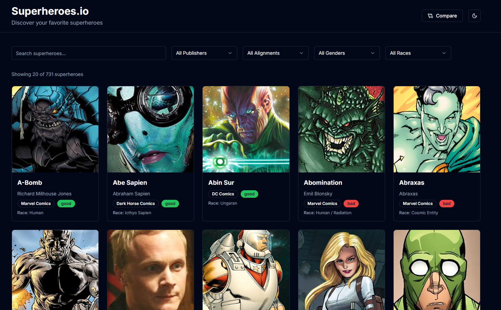

# 🦸‍♂️ Superheroes.io

**Superheroes.io** is a sleek, AI-powered web app where users can explore and interact with uniquely generated superheroes.  
Built with ❤️ using [Lovable AI](https://lovable.dev), it blends modern web tech with intuitive UI components.

🔗 [Live Demo](https://superheroes-io.vercel.app)

---

## ✨ Features

- 🤖 AI-generated superhero content with **Lovable AI**
- ⚛️ Built using **React + TypeScript + Vite**
- 🎨 Styled with **TailwindCSS**
- 💡 Accessible components powered by **Radix UI** + **shadcn/ui**
- ⚡ Blazing fast, clean, and responsive UI

---

## 📸 Preview




---

## 🧰 Tech Stack

| Tech            | Description                            |
|-----------------|----------------------------------------|
| **TypeScript**  | Strongly typed JavaScript              |
| **React + Vite**| Frontend framework & dev environment   |
| **Tailwind CSS**| Utility-first styling                  |
| **Radix UI**    | Unstyled accessible components         |
| **shadcn/ui**   | Beautiful, ready-to-use UI primitives  |
| **Lovable AI**  | Built with AI, simplified by prompts   |

---

## 🚀 Getting Started

To run the project locally:

```bash
git clone https://github.com/Sabbirhossain97/Superheroes.io.git
cd Superheroes.io
npm install
npm run dev
